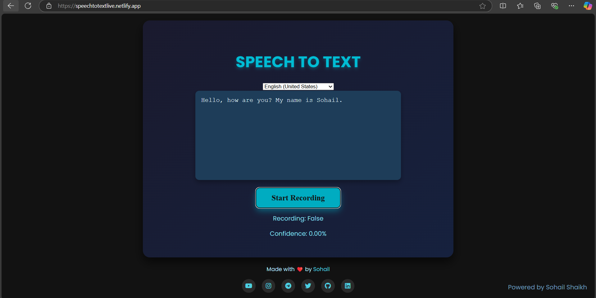

# Speech to Text Web Application 🎤➡️📝

## Description 📜

This is a simple **Speech to Text** web application that uses the browser's built-in speech recognition API (`webkitSpeechRecognition`). It converts your speech into text in real time, supporting various languages and dialects.

### Features 🌟
- **Multi-Language Support** 🌍: Select from a variety of languages and dialects.
- **Real-time Speech-to-Text** 🎙️➡️📝: Converts spoken words into text as you speak.
- **Confidence Level Display** 💯: Shows the confidence percentage of the speech recognition result.
- **Record/Stop** 🛑🎙️: You can start or stop the recording with a simple button click.

## Installation 🛠️

To run this project locally:

1. **Clone the Repository**:
   ```
   git clone https://github.com/Sohail-Shaikh-07/speech-to-text.git
   ```

2. **Open the HTML file**:
   - Navigate to the project folder.
   - Open `index.html` in your browser to start using the Speech to Text application.

## Usage 🧑‍💻

1. **Select Language** 🌐:
   - Choose a language from the dropdown menu for speech recognition.

2. **Start Recording** 🎙️:
   - Click the "Start Recording" button to begin speaking.
   - The speech will be transcribed into the text box.

3. **Stop Recording** ⏹️:
   - Click "Stop Recording" to halt the speech recognition.

4. **View Confidence** 📊:
   - The system will show the confidence level of the transcription (in percentage).

## Technologies Used 🖥️

- **HTML5** 🌐: Structure of the web page.
- **CSS3** 🎨: Styling the user interface.
- **JavaScript** 💻: Implementing the speech recognition functionality with `webkitSpeechRecognition`.
- **Font Awesome** ⭐: For social media icons.
- **Google Fonts (Poppins)** 🅰️: For font styling.

## Browser Support 🌍

This web application uses the `webkitSpeechRecognition` API, which is currently supported in the **Google Chrome** browser. Ensure that you are using a compatible browser.

## Live Demo 🚀

You can check out the live version of the application here:  
[Speech to Text Web App](https://speechtotextlive.netlify.app/)

## Screenshots 🖼️

 

## License 📝

This project is licensed under the MIT License - see the [LICENSE](LICENSE) file for details.
